# 📊 Project Simulation Report: Round Robin vs SJF
**Group:** C5  
**University:** Helwan University - Faculty of Computers and Information  
**Major:** Software Engineering

---

## 📝 Project Overview
This document provides a detailed analysis of the performance of **Round Robin (RR)** and **Shortest Job First (SJF)** scheduling algorithms across various workloads. It includes validation of input integrity and a comparative study of efficiency and fairness.

---

## 🚀 Test Scenarios (Execution & Results)

### Scenario A: Basic Mixed Workload
*   **Objective:** Observe behavior with a standard mix of processes.
*   **Inputs:** P1(BT:8, AT:0), P2(BT:4, AT:1), P3(BT:9, AT:2).
*   **Quantum:** 5.

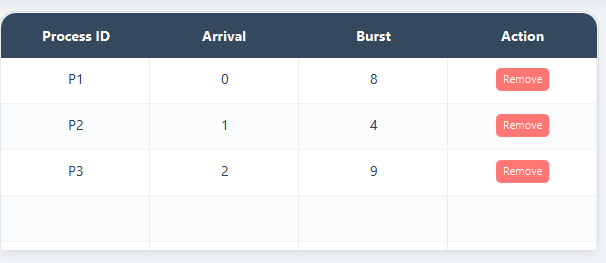
---
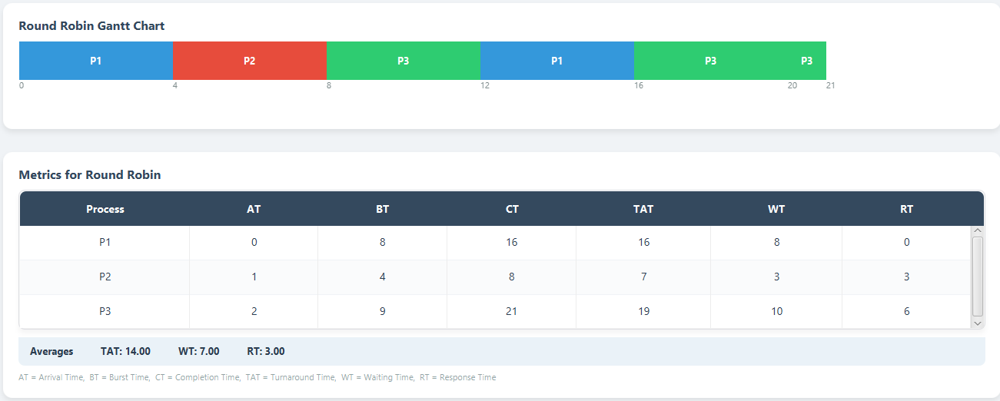
---

---
---

### Scenario B: Short-Job-Heavy Case
*   **Objective:** Test SJF's efficiency in handling short processes vs RR.
*   **Inputs:** P1(BT:20, AT:0), P2(BT:2, AT:2), P3(BT:1, AT:3).
*   **Quantum:** 2.

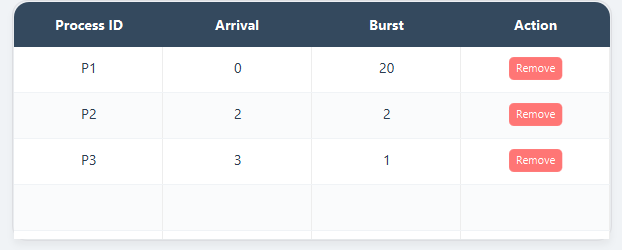
---
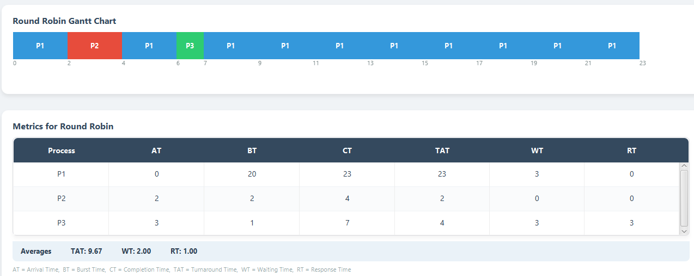
---
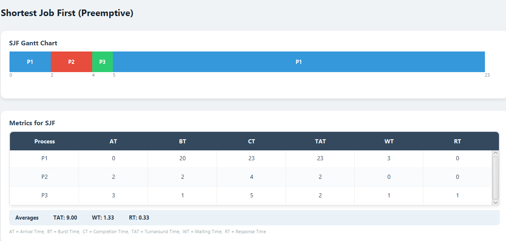
---
---

### Scenario C: Fairness Case
*   **Objective:** Evaluate performance when all processes arrive at the same time with identical bursts.
*   **Inputs:** P1(BT:10, AT:0), P2(BT:10, AT:0), P3(BT:10, AT:0).
*   **Quantum:** 3.

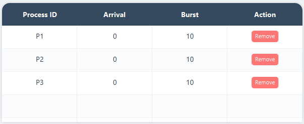
---
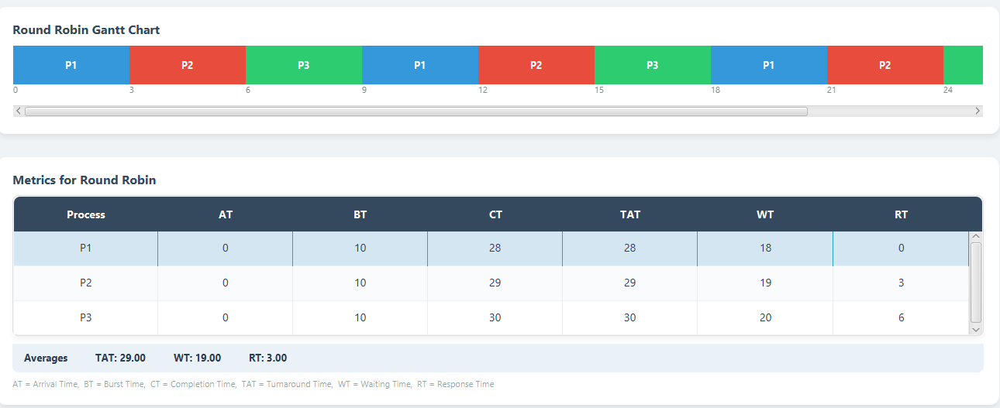
---
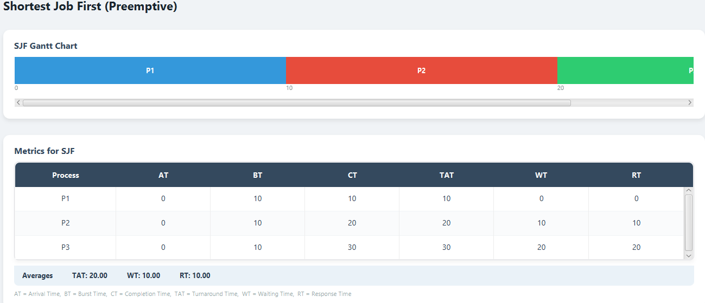
---
---

### Scenario D: Long-Job Sensitivity Case
*   **Objective:** Analyze the impact of a very long process on waiting times.
*   **Inputs:** P1(BT:30, AT:0), P2(BT:2, AT:1), P3(BT:2, AT:2).
*   **Quantum:** 5.

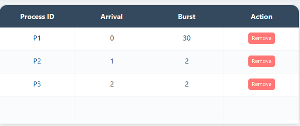
---
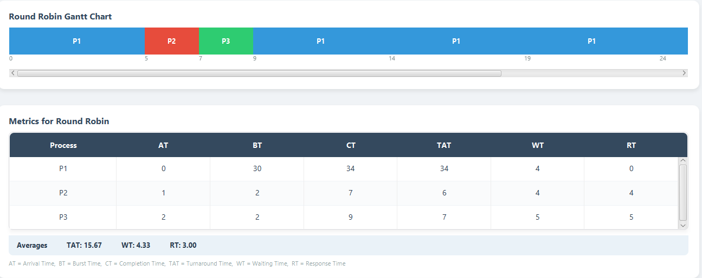
---
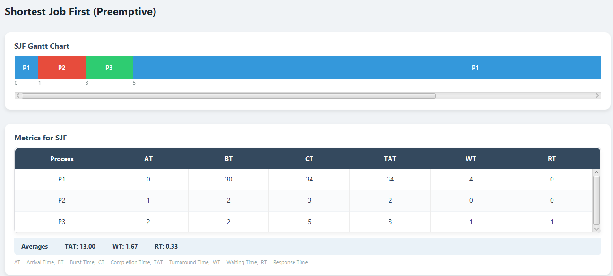
---
---

## 🛡️ Scenario E: Validation Case (Robustness)
**Objective:** To ensure the system handles incorrect inputs gracefully and prevents execution with invalid data.

*   **Behavior:** The system utilizes `ValidationUtil` to check for empty fields, negative Arrival Times, or non-positive Burst/Quantum values before simulation.
*   **Test Case:** Entering a negative value for Burst Time and Arrival Time simultaneously.
*   **Result:** An Alert Box appears stating: *"Both Arrival Time and Burst Time are invalid! Arrival must be (>=0) and Burst must be (>0)."*

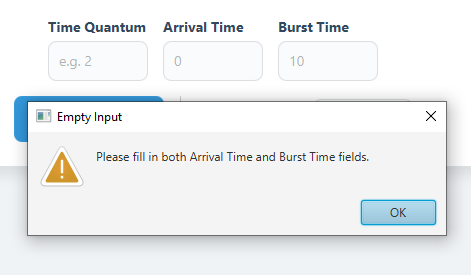
---
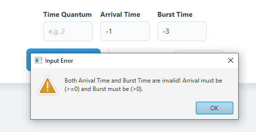
---
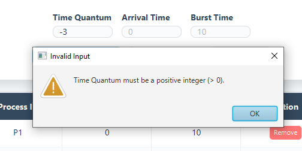
---
---

## 🔍 Required Analysis Questions
*Based on the observed simulations:*

1.  **Which algorithm gave lower average waiting time?**
  *   **SJF** typically yielded a lower Average Waiting Time (AWT), especially in Scenario B, by prioritizing shorter tasks and reducing the overall queue weight.
2.  **Which algorithm gave lower average response time?**
  *   **Round Robin** provided a lower Average Response Time (ART). Due to its preemptive nature, every process gets a CPU slice quickly after arrival.
3.  **Did Round Robin appear fairer across all processes?**
  *   **Yes.** Round Robin prevents "Starvation." Every process is guaranteed a time slice (Quantum), ensuring no long process can hog the CPU indefinitely.
4.  **Did SJF complete short jobs more efficiently?**
  *   **Yes.** SJF is designed for this purpose; by executing the shortest burst first, it maximizes throughput and finishes short tasks at the earliest possible time.
5.  **How did the chosen quantum affect Round Robin behavior?**
  *   The quantum (e.g., Q=3) acted as a balance. A smaller quantum improves response time but increases context-switching overhead, while a larger quantum makes RR behave more like FCFS.
6.  **Which algorithm would you recommend for the tested workload, and why?**
  *   **Recommendation:** Use **SJF** for batch systems where total efficiency and minimized wait times are the priority. Use **Round Robin** for interactive/multi-user systems where fairness and quick response to all users are essential.

---

## 🏁 Required Conclusion
*   **Performance Metrics:** SJF outperformed RR in efficiency metrics (Waiting/Turnaround), while RR excelled in responsiveness (Response Time).
*   **Balance:** Round Robin is significantly more balanced and fairer, ensuring all processes progress simultaneously.
*   **Efficiency:** SJF is the more efficient choice for minimizing the time processes spend in the system.
*   **Quantum Effect:** The selected quantum directly dictates the trade-off between system overhead and user responsiveness.

—

